<picture>
  <source media="(prefers-color-scheme: dark)" srcset="assets/banner-dark.svg">
  <source media="(prefers-color-scheme: light)" srcset="assets/banner-light.svg">
  
</picture>

 

 

Epinet에서 데이터 파이프라인과 컨테이너 인프라를 만듭니다. 개인 작업으로는 위치기반 소셜 앱 **Urius**를 혼자 기획해 App Store에 올렸고, 그 과정을 AI 에이전트 팀으로 자동화하는 일에 관심이 많습니다.

`대한민국 거주` &nbsp;·&nbsp; `새로운 기회에 열려 있습니다`

 

## 📍 Now

### UriUs

**50m 격자 위에 기록하는 위치기반 소셜 앱** 
그 자리에 가야만 열리는 숨겨진 메시지.

-2F6B4F?style=for-the-badge&labelColor=161513)

기획부터 출시까지, 코드의 대부분은 제가 설계한 LLM 에이전트 팀이 작성했습니다. 
어떻게 혼자서 이 규모를 감당했는지는 케이스 스터디에 정리했습니다.

**[📖 Urius 케이스 스터디 읽기 →](https://rohhj622.github.io/#/urius)**

 

## 💼 Career

**2024 – 현재 &nbsp;·&nbsp; Epinet** — DevOps · 데이터 엔지니어 
컨테이너 인프라 구축, 인증 시스템, CDC 파이프라인 운영 
`Docker` `Keycloak` `Debezium` `Kafka` `k8s` `Harbor`

**2024 &nbsp;·&nbsp; Epinet** — ML 엔지니어 · MLOps 
모델 개발부터 실험 관리, 서빙 파이프라인 자동화까지 
`MLflow` `MinIO` `Airflow`

**2023 – 2024 &nbsp;·&nbsp; Epinet** — 데이터 엔지니어 · DB 아키텍처 
대용량 데이터 파이프라인 설계, 시계열·분석 DB 도입 및 최적화 
`PostgreSQL` `TimescaleDB` `ClickHouse` `Airflow`

**2023 &nbsp;·&nbsp; Epinet** — Python 개발자 
Django 기반 웹 서비스 개발 
`Python` `Django` `JavaScript`

**2022 – 2023 &nbsp;·&nbsp; 개인 프로젝트** — OwnWay 
백엔드 API · 모바일 앱 · DB · AWS 배포까지 혼자 설계·구현 
`Django` `React Native` `PostgreSQL` `AWS` `Route53` `VPC`

**2021 – 2022 &nbsp;·&nbsp; 솔텍시스템** — 웹 개발자 
전자정부프레임워크 기반 공공 웹 서비스 개발, 영상 스트리밍 처리 
`Spring` `Java` `MySQL` `Oracle` `NiFi` `RTSP` `FFMPEG`

 

## 🛠️ Stack

**Language & Web**

**Database & Data Engineering**

**ML & MLOps**

**DevOps & Cloud**

**Learning**

 

## 📊 활동

 

